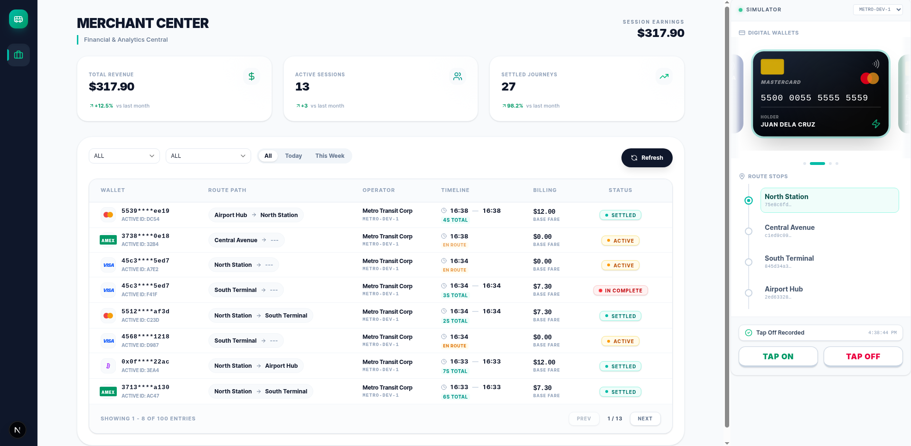

<div align="center">
<h1>LittleTrip</h1>
<p><strong>A transit tap-on / tap-off system</strong></p>
<p>Transit devices submit tap events to a REST API. The backend pairs taps into journeys and calculates fares. A Next.js dashboard lets operators view trips and simulate tap events in real time.</p>




</div>

---

## Prerequisites

- [Docker](https://docs.docker.com/get-docker/) + Docker Compose
- [pnpm](https://pnpm.io/installation)
- [k6](https://k6.io/docs/get-started/installation/) (optional, for load testing)

---

## Quick Start

The fastest way to run the full stack is a single script. It builds and starts every service, waits for the API to be healthy, fetches an operator API key automatically, and wires it into the web container.

```sh
# 1. Copy the env template and fill in admin credentials
cp .env.example .env

# 2. Start everything
./docker-start.sh
```

<div align="center">

| Service | URL |
|---------|-----|
| Dashboard | http://localhost:3000 |
| API | http://localhost:8081 |
| Swagger UI | http://localhost:8081/swagger-ui.html |
| Grafana | http://localhost:4000 |

</div>

> Full setup instructions, manual local dev, and environment variable reference: **[docs/setup.md](docs/setup.md)**

---

## Architecture

```
Transit Device
    │
    ▼ POST /taps  (X-API-Key)
┌─────────────────────────┐        ┌──────────────┐
│  Spring Boot API        │◄──────►│  PostgreSQL  │
│  (port 8081)            │        └──────────────┘
│  - Tap ingestion        │        ┌──────────────┐
│  - Journey state machine│◄──────►│    Redis     │
│  - Fare calculation     │        │ (cache +     │
│  - Rate limiting        │        │  rate limit) │
└─────────────────────────┘        └──────────────┘
    ▲
    │ HTTP (X-API-Key / Basic auth)
    ▼
┌─────────────────────────┐
│  Next.js Dashboard      │
│  (port 3000)            │
│  - Trip viewer          │
│  - Tap simulator        │
│  - Merchant KPI cards   │
└─────────────────────────┘
```

**Monorepo** — pnpm + Turborepo:

| Path | Description |
|------|-------------|
| `apps/web` | Next.js 16 / React 19 / Tailwind v4 |
| `apps/api` | Spring Boot 3.2 / Java 17 |
| `packages/eslint-config` | Shared ESLint config |
| `packages/typescript-config` | Shared `tsconfig.json` |

> Full layer structure, data flow, database schema, and observability stack: **[docs/architecture.md](docs/architecture.md)**

---

## API

All operator endpoints require an `X-API-Key` header. Admin endpoints use HTTP Basic auth.

```sh
curl -X POST http://localhost:8081/api/v1/taps \
  -H "X-API-Key: <key>" \
  -H "Content-Type: application/json" \
  -d '{
    "id": "550e8400-e29b-41d4-a716-446655440000",
    "deviceId": "<device-uuid>",
    "stopId": "<stop-uuid>",
    "cardToken": "card-abc-123",
    "tapType": "ON",
    "dateTimeUtc": "2024-01-15T09:30:00Z"
  }'
```

> All endpoints, rate limits, error codes, and the idempotency model: **[docs/api.md](docs/api.md)**

---

## Business Rules

| Scenario | Result |
|----------|--------|
| Tap ON — no open journey | New `IN_PROGRESS` journey |
| Tap ON — open journey exists | Close as `INCOMPLETE` (max fare), start new journey |
| Tap OFF — open journey, different stop | `COMPLETED` (fare from fare table) |
| Tap OFF — open journey, same stop | `CANCELLED` (no charge) |
| Tap OFF — no open journey | Ignored |

Fares are stored in **cents**. The max fare is charged for incomplete journeys (tap ON without a matching tap OFF).

> Full state machine, fare table, device authorization model, and caching rules: **[docs/business-rules.md](docs/business-rules.md)**

---

## Commands

<details>
<summary><strong>Root (Turborepo)</strong></summary>

```sh
pnpm dev           # Start all apps
pnpm build         # Build all apps
pnpm lint          # Lint all apps
pnpm check-types   # TypeScript check
pnpm format        # Prettier format
```

</details>

<details>
<summary><strong>Web — <code>apps/web</code></strong></summary>

```sh
pnpm test          # Vitest watch mode
pnpm test:run      # Vitest single run (CI)
```

</details>

<details>
<summary><strong>API — <code>apps/api</code></strong></summary>

```sh
./mvnw spring-boot:run
./mvnw test
./mvnw test -Dtest=ClassName
./mvnw package -DskipTests
```

</details>

<details>
<summary><strong>Infrastructure</strong></summary>

```sh
docker compose up -d postgres redis                      # DB + cache only
docker compose up -d prometheus grafana redis-exporter   # Observability stack
```

</details>

<details>
<summary><strong>Load testing — <code>k6/</code></strong></summary>

```sh
cd k6 && ./run.sh

# Custom target
BASE_URL=http://staging.example.com ./run.sh
```

Requires [k6](https://k6.io/docs/get-started/installation/) installed locally. Metrics are pushed to Prometheus and visible in Grafana at http://localhost:4000 while the test runs.

</details>

---

## Documentation

| Doc | Contents |
|-----|----------|
| [Setup](docs/setup.md) | Quick start, manual dev, env var reference |
| [API](docs/api.md) | All endpoints, auth, rate limiting, error codes |
| [Business Rules](docs/business-rules.md) | Journey state machine, fare calculation, device auth |
| [Design Decisions / Assumptions and Limitations](docs/design-decisions.md) | Assumptions, limitations and reasoning behind changes from the original spec |
| [Architecture](docs/architecture.md) | System diagram, layer structure, DB schema, observability |
| [Load Testing](docs/load-testing.md) | k6 stress test scenarios, thresholds, Grafana monitoring |
